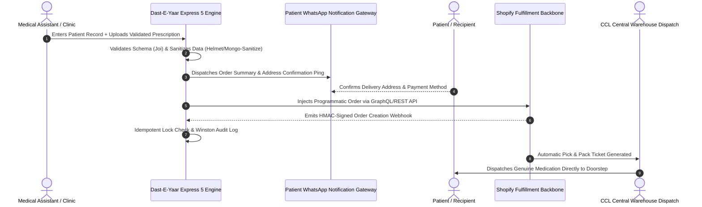

# 📦 Dast-E-Yaar — Enterprise Direct-to-Patient Pharmaceutical Logistics Engine

[-000000?style=for-the-badge&logo=express&logoColor=white)]()
[]()
[]()
[]()
[]()

> **Enterprise Notice & Commercial Disclaimer**:  
> Engineered for **CCL Pharmaceuticals** (a premier multinational pharmaceutical manufacturer in Pakistan) via **Softsols Pakistan**.  
> Production database schemas, commercial client API credentials, and internal logistics infrastructure are protected under corporate NDA. This repository documents the systems architecture, clinic-to-patient order fulfillment automation, and idempotent webhook synchronization design.

---

## 🏛️ Executive Summary & Workflow Pipeline

In traditional pharmaceutical distribution, patients visiting specialist clinics receive paper prescriptions, face counterfeit medication risks at retail pharmacies, and endure stock-out delays for critical medications. 

**Dast-E-Yaar** was engineered for **CCL Pharmaceuticals** to establish a direct, automated fulfillment pipeline linking clinical consulting rooms directly to CCL Pharma's central distribution warehouses.



---

## 🛠️ Core Engineering Subsystems

### 1. High-Reliability Express 5 & TypeScript Architecture
* **Strict Static Typing:** Eliminates runtime null-pointer exceptions in mission-critical medical order states.
* **Defensive Security Stack:** Multi-layer middleware including `helmet` for HTTP response hardening, `express-mongo-sanitize` for NoSQL injection neutralization, and `joi` for strict request body schema validation.
* **Production Observability:** Structured logging via **Winston** with daily log rotation and separated error vs. audit transport streams.

### 2. Idempotent Shopify Webhook Bridge (`@shopify/shopify-api`)
* **The Problem:** High-concurrency network spikes and webhook retries from Shopify can trigger duplicate pharmaceutical orders or conflicting dispatch tickets.
* **The Solution:** Built an idempotent webhook consumer that verifies Shopify cryptographic **HMAC-SHA256 signatures** and performs atomic database transaction locks on order status fields before executing mutations.

### 3. Asynchronous Clinic-to-Patient Coordination
* Direct integration connecting doctor assistants' prescription entry forms to asynchronous notification gateways, ensuring patients receive verified dosage instructions and delivery tracking without manual phone calls.

---

## 📁 Repository Structure

```
dasteyaar-pharma-logistics/
├── snippets/
│   └── shopify-idempotent-webhook.ts  # Cryptographic HMAC verification & order mutation lock
├── README.md                          # Master architectural whitepaper
└── LICENSE                            # MIT License
```

---

## 📄 License
This case study is published under the [MIT License](LICENSE).
