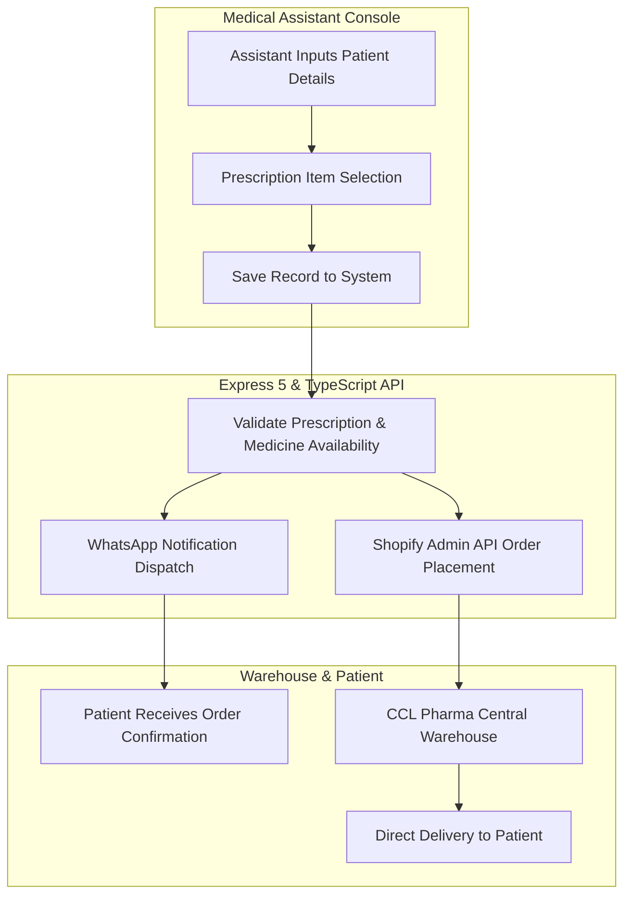

# Dast-E-Yaar — Prescription Fulfillment & Logistics Pipeline

Systems architecture and integration case study for **Dast-E-Yaar**, a direct-to-patient medication ordering and fulfillment pipeline engineered for **CCL Pharmaceuticals** via Softsols Pakistan.

---

## Role & Scope

* **Role:** Sole Backend Developer
* **Context:** Built under Softsols Pakistan for CCL Pharmaceuticals. Engineered the ordering and dispatch service from scratch.
* **Scope of Ownership:** Built the Express 5 and TypeScript backend, integrated the Shopify Admin API for automated order placement, configured WhatsApp notification webhooks, and implemented order fulfillment scripts (`fulfillOrder.ts`, `markOrderAsPaid.ts`).

---

## System Flow

---

## Technical Highlights

* **Clinic Prescription Intake:** Clinic assistants enter patient demographics and prescribed medications into the system, validating inventory items before submission.
* **Shopify Order Automation:** Programmatically creates orders via the Shopify REST Admin API, attaching customer addresses, medication line items, and fulfillment tags for the warehouse team.
* **WhatsApp Notification Dispatch:** Sends real-time WhatsApp confirmation messages to patients with order details, instructions, and delivery notices upon prescription entry.
* **Order Management Tooling:** Built operational scripts for marking orders as paid, updating fulfillment statuses, and tracking warehouse dispatch.

---

## Tech Stack

* **Backend:** Node.js, Express 5, TypeScript
* **Database:** MongoDB, Mongoose
* **Integrations:** Shopify Admin REST API (`@shopify/shopify-api`), WhatsApp Business Webhooks
* **Security & Logging:** Winston, Helmet, CORS

---

## Notice

Proprietary patient prescription records, customer identities, and corporate API credentials belong to CCL Pharmaceuticals and Softsols Pakistan. This repository documents software architecture and integration workflows.
