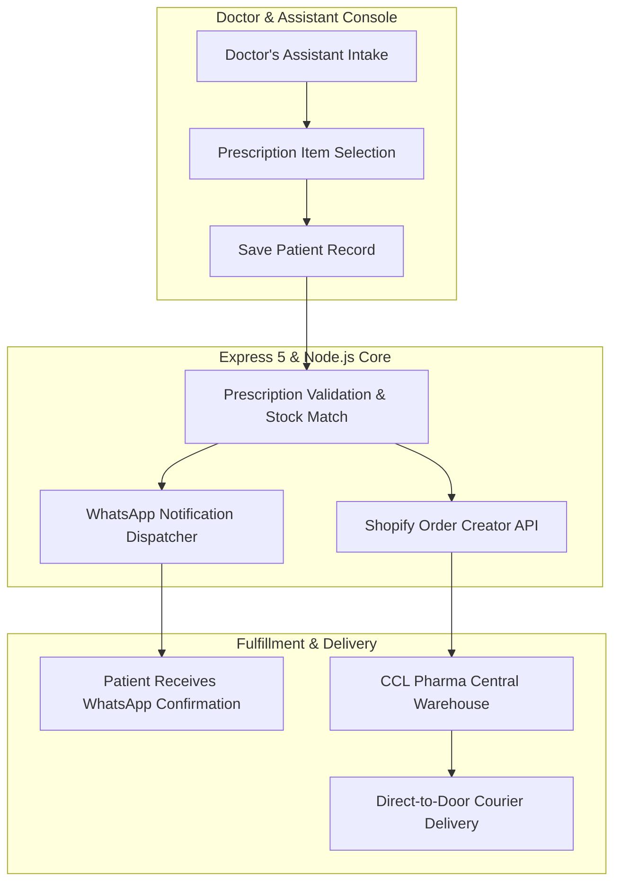

# Dast-E-Yaar — Pharmaceutical Fulfillment & WhatsApp Routing Engine

Systems architecture and engineering case study for **Dast-E-Yaar**, an automated direct-to-patient medication fulfillment pipeline engineered for **CCL Pharmaceuticals** via Softsols Pakistan.

---

## Role & Individual Ownership

* **Role:** Sole Architect & Backend Lead
* **Context:** Built under Softsols Pakistan for CCL Pharmaceuticals. Engineered the system from ground up.
* **Scope of Ownership:** Clinical intake workflow, webhook integration, Shopify REST Admin API automated ordering, and WhatsApp Business dispatch pipeline.

---

## Architecture Pipeline

---

## Core Technical Highlights

* **Clinical Order Pipeline:** Doctor's assistant inputs patient demographics and verifies prescription items; saving the record triggers synchronous order validation against the pharmaceutical SKU catalog.
* **Automated WhatsApp Confirmation:** Dispatches real-time WhatsApp verification messages to the patient containing order summaries, delivery tracking, and dosage instructions via WhatsApp Business API webhooks.
* **Shopify REST API Order Creation:** Programmatically synthesizes verified orders into CCL Pharma's Shopify backend, attaching shipping addresses, billing tags, and delivery timeframes for warehouse dispatch.
* **Direct-to-Door Logistics:** Eliminates retail intermediary delays by dispatching genuine medications directly from CCL Pharma's central supply chain to patient residences.

---

## Tech Stack

* **Backend:** Node.js, Express 5 REST API
* **Database:** MongoDB
* **APIs & Webhooks:** Shopify REST Admin API, WhatsApp Business API
* **Deployment:** Secure cloud container instance

---

## Notice

Proprietary patient prescription records, pharmaceutical formulations, and commercial enterprise endpoints belong to CCL Pharmaceuticals and Softsols Pakistan. This repository documents software architecture and integration specifications.
